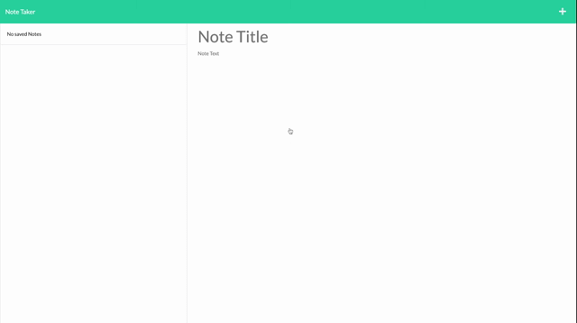

# Note Taker

## Description

Note Taker is a application that can be used to write, save and delete notes. This application will use an Express.js back end and will save and retrieve note data from a JSON file.

Here is the link to the [deployed application](https://sp-note-taker-app.herokuapp.com/)

### Features

- Easy to use
- Provide options to write, save and delete the notes
- Generates a responsive webpage

## Table of Contents

- [Installation](#installation)
- [Usage](#usage)
- [Technologies Used](#technologies-used)
- [Credits](#credits)
- [License](#license)

## Installation

- Create a new repository on your GitHub account.
- Clone this repository.
- Run `npm install`
- Run `node server.js`

## Usage

This project can be used in any web browser or on any devices including the mobile devices.

The following is the demo screenshot of the deployed application.



Following is a code snippet of the application page.

Here it refers to the POST Route for posting a new note in the note taker app.

```Node.js


app.post("/api/notes", (req, res) => {
  console.log(req.body);

  const { title, text } = req.body;

  if (req.body) {
    const newNote = {
      title,
      text,
      id: uuidv4(),
    };

    readAndAppend(newNote, "./db/db.json");
    res.json(`Note is added successfully 🚀`);
  } else {
    res.error("Error in adding a note");
  }
});

```

## Technologies Used

- Node.js
- Express.js
- Heroku
- Bootstrap
- Git
- GitHub

## Credits

- npmjs.com
- MDN / W3Schools

## License

This project is licensed under the [MIT](./LICENSE) license.
